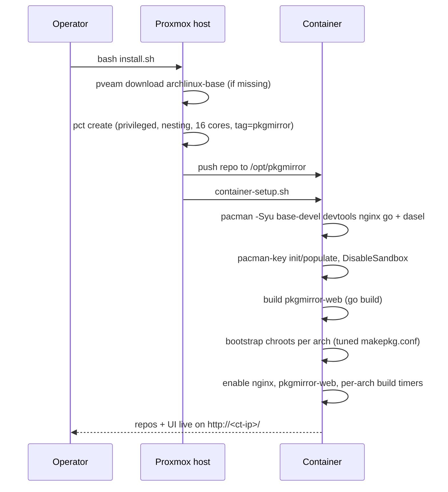
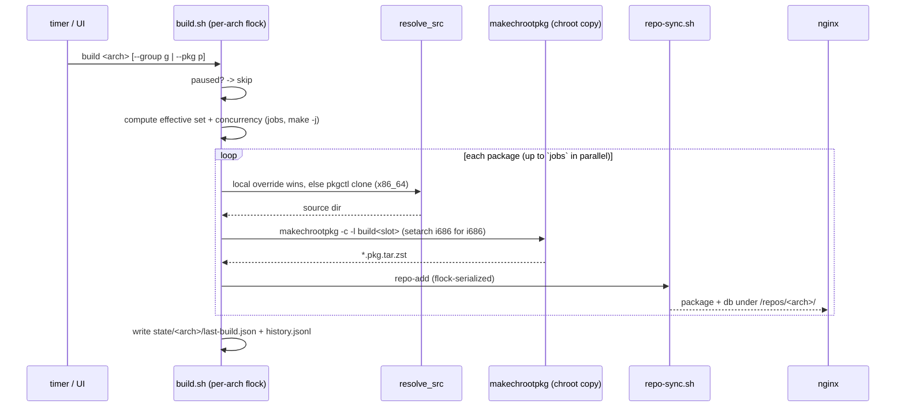
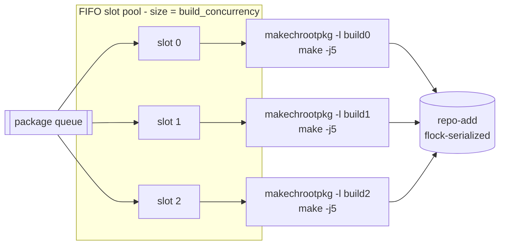

# Architecture

## What it is

pkgmirror is a self-hosted **overlay repository** builder for Arch Linux and
archlinux32. It rebuilds selected packages — tuned for a specific target CPU
(`-march=…`) and/or patched with your own PKGBUILDs — and serves them as
pacman-compatible repositories over HTTP. Clients keep using the official
`core`/`extra` repos and only pull the rebuilt packages from a higher-priority
local repo, falling back cleanly to upstream for everything else.

It runs as a Proxmox VE LXC container provisioned by a `curl | bash` helper, in the
style of the community-scripts project.

### Why an overlay, not a full rebuild

Only a handful of packages benefit from CPU tuning (codecs, graphics, compression,
crypto) or need patching (archlinux32's inconsistently-maintained packages). Rebuilding
an entire distribution is wasteful and fragile. An overlay rebuilds just what matters
and layers it on top of the stock system.

## Targets

| arch     | base    | tuning                          | toolchain    | example machine              |
|----------|---------|---------------------------------|--------------|------------------------------|
| `atom`   | i686    | `-march=atom -mtune=atom`       | devtools32   | Intel Atom N270 (Aspire One) |
| `btver1` | x86_64  | `-march=btver1 -mtune=btver1`   | devtools     | AMD C-60 (Bobcat)            |

The build host is x86_64, so **i686 builds run natively** (no emulation) — only a
`setarch i686` personality wrap is used for a clean i686 chroot.

## Component overview

```mermaid
flowchart TB
    subgraph host[Proxmox VE host]
        install[install.sh<br/>curl bash helper]
    end

    subgraph ct[LXC container - privileged, Arch Linux]
        direction TB
        repo[/opt/pkgmirror<br/>code + config/]
        subgraph tooling[build tooling]
            build[bin/build.sh]
            group[bin/group.sh]
            control[bin/control.sh]
            reposync[bin/repo-sync.sh]
        end
        subgraph chroots[/srv/pkgmirror/chroots]
            atomc[atom chroot - i686]
            btverc[btver1 chroot - x86_64]
        end
        served[/srv/pkgmirror/repos<br/>atom-local.db, btver1-local.db/]
        web[pkgmirror-web<br/>Go service :8080]
        nginx[nginx :80]
        timers[systemd timers<br/>pkgmirror-build@arch]
    end

    subgraph clients[Client machines]
        atompc[Atom PC<br/>pacman]
        c60pc[C-60 PC<br/>pacman]
    end

    install -->|pct create + push| ct
    timers --> build
    web --> build
    build --> chroots
    build --> reposync
    reposync --> served
    nginx -->|/repos static| served
    nginx -->|/ and /api proxy| web
    atompc -->|http /repos/atom| nginx
    c60pc -->|http /repos/btver1| nginx
```

## Runtime layout

Inside the container:

| Path                              | Contents                                              |
|-----------------------------------|-------------------------------------------------------|
| `/opt/pkgmirror`                  | this repo (git clone or pushed tree): code + config   |
| `/srv/pkgmirror/chroots/<arch>/`  | per-arch devtools build chroots (`root` + copies)     |
| `/srv/pkgmirror/repos/<arch>/`    | served packages + repo db (`<arch>-local.db`)         |
| `/srv/pkgmirror/work/<arch>/`     | scratch build dirs (cloned/copied PKGBUILDs)          |
| `/srv/pkgmirror/state/<arch>/`    | `last-build.json`, `history.jsonl`                    |
| `/srv/pkgmirror/state/paused`     | pause flag (present ⇒ builds suspended)               |

`/opt/pkgmirror/config` and `/opt/pkgmirror/pkgbuilds` are owned by the `pkgmirror`
service user so the web UI can edit them; the rest of `/srv/pkgmirror` is also
`pkgmirror`-owned.

## Provisioning flow



Re-running `install.sh` when a `pkgmirror`-tagged container already exists performs an
**in-place update** instead (refresh code, rebuild binary, re-apply setup) — your
config and PKGBUILDs are preserved. See the [user guide](user-guide.md#updating).

## Build & serve flow



Key rules:

- **Per-arch serialized** by `flock`; **different arches run concurrently**.
- A package that fails to build is logged and **skipped** — it never aborts the batch.
- Up-to-date packages are skipped unless `--force`.
- **Local override wins**: if `pkgbuilds/<arch>/<pkg>/PKGBUILD` exists it is used and
  never overwritten by an upstream sync.

## Parallelism model

The host is a 32-thread Xeon; the container gets 16 cores by default. Within an arch,
`build_concurrency` packages build at once, each in its **own named chroot copy**
(`build0`, `build1`, …) handed out by a FIFO slot semaphore. The available cores are
split across them so N parallel builds at `-j(cores/N)` ≈ one full machine rather than
N× oversubscription.



Cross-arch parallelism is free: `atom` and `btver1` use different flock keys and
separate systemd timer instances, so both can build simultaneously.

## Serving path

nginx fronts everything on port 80:

- `location /repos/` → served **statically** from `/srv/pkgmirror` (the fast path for
  pacman clients: `<arch>-local.db` + `*.pkg.tar.zst`).
- everything else → **proxied** to the `pkgmirror-web` Go service on `127.0.0.1:8080`
  (dashboard + JSON/ops API + SSE log streaming, with `proxy_buffering off`).

## Web service

`pkgmirror-web` is a single Go binary (one dependency, `pelletier/go-toml/v2`) with
the SPA embedded via `//go:embed`. It reads config *natively* — `internal/pkgconfig`
parses `config/*.toml` directly in-process, no subprocess spawns — reads state files,
queries `systemd`/`journald`, and streams live build logs over SSE (both the build
console and per-package "log so far" view). Config **writes** (add/remove package, set
an override, edit a group/arch) still shell out to the `bin/*.sh` scripts —
**bash remains the single source of truth** for build logic and for anything that
mutates `config/*.toml`. This split exists because `config/arches/*.toml` and
`config/groups/*.toml` carry hand-written `#`-comments that no Go TOML library
round-trips safely through a typed marshal; reading never touches that, only writing
would. It runs as the `pkgmirror` user (which has passwordless sudo) and binds
localhost behind nginx.

## Trust & security model

This is a dedicated, LAN-internal build box, and the design reflects that:

- **Privileged container.** Arch `devtools` must bind-mount `/dev`, `/proc`, `/sys` to
  build in a chroot, which an unprivileged LXC denies. The trust boundary is the
  container itself.
- **`pkgmirror` has full passwordless sudo** — `makechrootpkg` requires it.
- **Repos are served `SigLevel = Optional TrustAll`** (unsigned) — intended for a
  trusted LAN. A GPG-signing path can be added later.
- **The web UI has no authentication** (LAN trust). It can trigger builds and edit
  files, so it binds localhost behind nginx; a clean seam exists to add nginx
  basic-auth. See the [user guide](user-guide.md#security).
- **Source PGP and test suites are skipped by default** (`skip_pgp_check`,
  `skip_check`) — the chroot has no upstream keys, and CPU-tuned test binaries can't
  reliably run on a different-CPU build host (e.g. `btver1`'s SSE4A on an Intel host).
  See [data model → build settings](data-model.md#global-settings-configpkgmirrortoml).
