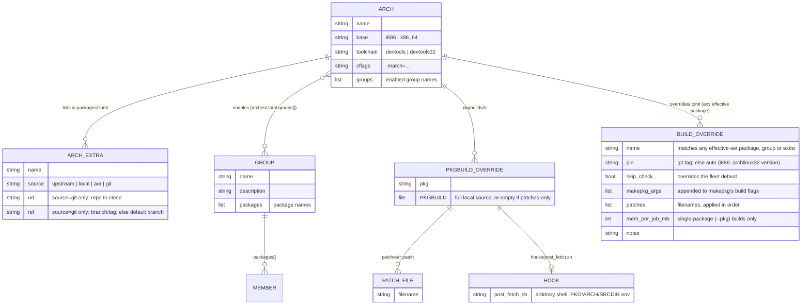
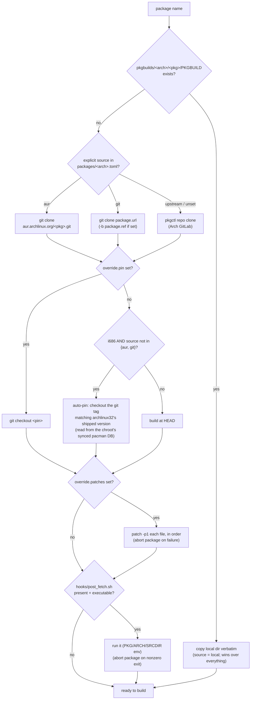
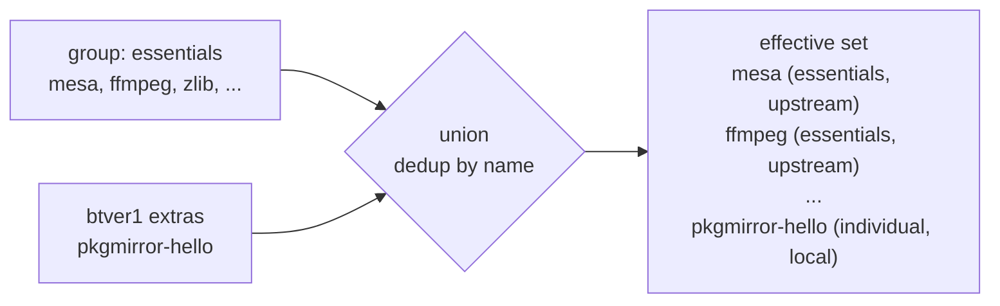

# Data model

All configuration is TOML under `config/`. `bin/*.sh` (build orchestration, and every
config *write*) reads/writes it through a single parser (`dasel`) wrapped by helpers in
[`bin/lib/common.sh`](../bin/lib/common.sh). `pkgmirror-web`'s dashboard *reads* the
same files natively in Go (`web/internal/pkgconfig`) for speed — no subprocess spawns
on every `/api/status` poll — but never writes them; all mutations still go through
`bin/*.sh`, so bash stays the single source of truth for what a change actually means.

## Files at a glance

| File                                         | Purpose                                                        |
|-----------------------------------------------|----------------------------------------------------------------|
| `config/arches/<arch>.toml`                  | an architecture: base, toolchain, CFLAGS, chroot source, enabled groups |
| `config/groups/<group>.toml`                 | a reusable named catalog of package names (arch-agnostic)      |
| `config/packages/<arch>.toml`                | per-arch **extra** packages + source (`upstream` \| `local` \| `aur` \| `git`) |
| `config/overrides/<arch>.toml`               | per-arch **build overrides**: pin/skip_check/makepkg_args/patches/mem, for *any* package in the effective set |
| `config/pkgmirror.toml`                      | global settings (concurrency, skip flags, default mem/job)     |
| `pkgbuilds/<arch>/<pkg>/PKGBUILD`            | local override PKGBUILD (patched/forked, or a fully custom package) — wins over upstream/AUR |
| `pkgbuilds/<arch>/<pkg>/patches/*.patch`     | patch files referenced by that package's override entry        |
| `pkgbuilds/<arch>/<pkg>/hooks/post_fetch.sh` | optional arbitrary-shell hook, run after fetch/pin/patches, before the build |

`config/packages/<arch>.toml` and `config/overrides/<arch>.toml` answer two
different questions and are deliberately separate files: packages.toml decides
**what** gets built (is this package in the set at all, and via which source);
overrides.toml decides **how** a package already in the set gets built. Setting
an override never changes a package's origin — pinning or patching a group
member doesn't relabel it as an "individual" extra.

## Relationships



### `config/arches/<arch>.toml`

```toml
name      = "btver1"
base      = "x86_64"                       # drives personality + chroot bootstrap
toolchain = "devtools"                      # devtools (x86_64) | devtools32 (i686)
cflags    = "-march=btver1 -mtune=btver1 -O2 -pipe"
groups    = ["essentials"]                  # which groups this arch builds

[chroot]
mirror  = "https://geo.mirror.pkgbuild.com/$repo/os/$arch"
keyring = "archlinux-keyring"
```

`base` is the key discriminator: `i686` builds are wrapped in `setarch i686` and the
chroot is bootstrapped from archlinux32 mirrors (with its keyring imported); `x86_64`
builds run natively with stock devtools, normally against the container's own
vanilla-Arch mirrorlist (`chroot.mirror`/`chroot.keyring` unused in that case).

Setting `chroot.keyring = "manjaro-keyring"` on an `x86_64` arch switches
`installer/bootstrap-chroot.sh` to a third path: it imports Manjaro's own keyring
(same trust-on-first-use pattern as the archlinux32 case) and bootstraps against
`chroot.mirror` instead of the container's mirrorlist — see the `manjaro` example
arch. This matters because Manjaro is a genuinely different distro from vanilla Arch
(its own repos, and it deliberately holds packages back from Arch's `extra` for
stability), not just a different CPU target on the same one. `cflags` can be left
empty (`""`) if the arch exists purely to offload builds rather than tune them — the
makepkg.conf CFLAGS-override step is skipped entirely when empty.

### `config/groups/<group>.toml`

```toml
name        = "essentials"
description = "Packages worth recompiling with -march tuning"
packages    = ["mesa", "ffmpeg", "x264", "zlib", "openssl", ...]
```

A group is an **arch-agnostic list of package names** — "things worth building." It
does not say *how* to build them; source resolution is decided per arch at build time.

### `config/packages/<arch>.toml`

```toml
[[package]]
name   = "xf86-video-intel"   # atom-specific, not part of any group
source = "local"               # upstream | local | aur | git

[[package]]
name = "linux-atom"            # a fully custom package, hosted in your own repo
source = "git"
url    = "https://github.com/you/linux-atom.git"
ref    = "stable"              # optional — omit to track the repo's default branch
```

Per-arch **extras**: packages built for this arch beyond its groups, plus explicit
source overrides. Most packages live in groups; this file is for one-offs.

`source` also doubles as a way to force a *group member's* source without adding
it as an extra's origin (e.g. `source = "aur"` on a package that's also in
`essentials`) — see [the origin-tagging fix](#the-effective-build-set) below.

- **`upstream`** (default) — clone the package's official Arch packaging repo.
- **`local`** — `pkgbuilds/<arch>/<pkg>/PKGBUILD` *is* the whole package: a
  patched fork of an upstream PKGBUILD, or something with no upstream at all
  (mesa-amber — confirmed absent from both Arch and AUR — or a fully custom
  package like a hand-tuned kernel). Never touched by a sync.
- **`aur`** — clone `https://aur.archlinux.org/<pkg>.git` instead of Arch's
  GitLab. Independent of the i686 archlinux32 pin (AUR packages have no
  archlinux32 version relationship) unless an override sets an explicit `pin`.
- **`git`** — clone an arbitrary `url` (required), optionally checked out at
  `ref` (a branch or tag; omit to track the repo's default branch). For a fully
  custom package you maintain yourself elsewhere — e.g. a hand-tuned kernel like
  `linux-atom` — instead of vendoring its PKGBUILD into *this* repo as `local`,
  point at your own repo and pkgmirror always builds whatever's current there.
  Like `aur`, no archlinux32 auto-pin (a personal repo has no such relationship)
  unless an override sets an explicit `pin`.

Local PKGBUILD presence always wins regardless of `source`, same as before.
`git` and `local` solve the same problem — a package with no Arch/AUR
equivalent — the difference is just where the PKGBUILD lives: vendored into
`pkgbuilds/<arch>/<pkg>/` (`local`) vs. fetched fresh from your own repo on
every build (`git`).

### `config/overrides/<arch>.toml`

```toml
[[override]]
name           = "harfbuzz"        # any package in the arch's effective set
pin            = "7.1.0-1"         # force this git tag; else automatic
skip_check     = true              # overrides config/pkgmirror.toml's default
makepkg_args   = ["--nodeps"]      # appended to makepkg's build flags
patches        = ["icu-fix.patch"] # applied in order, from .../harfbuzz/patches/
mem_per_job_mb = 2048              # single-package (--pkg) builds only
notes          = "archlinux32 ships an old harfbuzz against current ICU"
```

All fields optional except `name`. Edit via `bin/override.sh` (see
[CLI reference](user-guide.md#cli-reference)) or the dashboard's per-package
**Override** button — both go through the same dasel-index-based writer, so
they never disagree. A `patches` filename must exist under
`pkgbuilds/<arch>/<pkg>/patches/`; an optional
`pkgbuilds/<arch>/<pkg>/hooks/post_fetch.sh` is the escape hatch for anything
the declarative fields don't cover (same trust level as PKGBUILD itself — no
new privilege boundary in this LAN tool).

### Build resolution pipeline

`resolve_src` (in [`bin/build.sh`](../bin/build.sh)) turns one package name into
a ready-to-build source directory:



The i686 auto-pin exists because archlinux32 rebuilds Arch's own PKGBUILDs at
pinned revisions and lags upstream — building Arch HEAD in an i686 chroot can
hit a dependency graph archlinux32's repo doesn't have yet (a package split, a
soname bump), and would produce a package too new to install on the
archlinux32 target anyway. `build_pkg` separately merges the override's
`skip_check`/`makepkg_args` into the makepkg invocation, and (for single-package
`--pkg` builds only) `mem_per_job_mb` into the memory-aware `make -j` cap — see
[build settings](user-guide.md#build-settings).

### `config/pkgmirror.toml` — global settings

```toml
build_concurrency    = 3     # parallel package builds per arch (cores split across them)
skip_pgp_check       = true  # skip upstream SOURCE signature verification
skip_check           = true  # skip each package's check()/test suite
build_mem_per_job_mb = 1536  # RAM estimate per parallel compile job (caps make -j)
```

- **`build_concurrency`** — how many packages build simultaneously within one arch.
  Each gets its own chroot copy; `make -j` = `cores / build_concurrency`. Set `1` for
  strictly sequential builds.
- **`skip_pgp_check`** (default `true`) — the clean chroot has no upstream signing
  keys and PKGBUILDs come from official Arch git over HTTPS, so source-signature
  verification would otherwise fail with "unknown public key". Set `false` only if you
  import the needed keys.
- **`skip_check`** (default `true`) — **required for cross-tuned builds.** Packages are
  compiled with the *target's* `-march` (e.g. `btver1` emits SSE4A, an AMD-only ISA)
  but a package's `check()` runs the freshly-built binary on the *build host* (an Intel
  Xeon with no SSE4A), which can fault. Set `false` only if the build host shares the
  target's instruction set. Per-package override: `skip_check` in
  `overrides/<arch>.toml`.
- **`build_mem_per_job_mb`** (default `1536`) — heavy C++ translation units tuned
  with `-O2` can peak over a GB in `cc1plus`; on a memory-limited container,
  `cores / build_concurrency` parallel compilers can exhaust RAM and get
  OOM-killed. `build.sh` caps the *total* concurrent compile jobs to
  `MemTotal / build_mem_per_job_mb` before applying the CPU-based `make -j`, so
  builds slow down instead of dying. Raising the container's RAM lifts the cap
  automatically. Per-package override (single-package `--pkg` builds only):
  `mem_per_job_mb` in `overrides/<arch>.toml` — e.g. a kernel build wants far
  more headroom than the fleet default.

> **Maintainer note — field separator.** `pkg_override` (`bin/lib/common.sh`)
> emits its fields joined by the ASCII unit separator (`0x1F`), not a tab. Tab
> is IFS *whitespace* in bash, so `IFS=$'\t' read` silently collapses
> consecutive/empty fields instead of preserving them — an empty
> `makepkg_args` would shift `patches`/`mem_per_job_mb`/`notes` left by one.
> Any new consumer of `pkg_override`/`overrides_all` (bash *or* Go — see
> `overrideSep` in `web/main.go`) must split on that same separator, not `\t`.

## The effective build set

What actually gets built for an arch is derived, not stored:

```
effective_packages(arch) =
      ⋃  members(g)  for g in arch.groups          # every enabled group's members
    ∪  { p.name for p in packages(arch) }          # per-arch extras
    (deduplicated by name)
```

For each resulting package:

- **`source`** = the explicit override in `packages/<arch>.toml` if present
  (`upstream` | `local` | `aur` | `git`); otherwise `local` when
  `pkgbuilds/<arch>/<name>/PKGBUILD` exists (file presence is authoritative —
  the **local-override-wins** rule); otherwise `upstream`.
- **`origin`** = the group name(s) it came from and/or `individual` — a
  `packages/<arch>.toml` entry only ever *adds* `individual`; it never
  *replaces* a group origin. A `[[package]]` entry used solely to force
  `source = "aur"` on an existing group member leaves its origin as that group's
  name, not `individual` (fixed in `effective_packages`, `bin/lib/common.sh`).
- **build overrides** (pin/patches/skip_check/…) are looked up separately per
  package from `overrides/<arch>.toml` at build time — they don't affect
  `source` or `origin` at all, by design (see [the overrides
  file](#configoverridesarchtoml) above).



This derivation lives in `effective_packages` in
[`bin/lib/common.sh`](../bin/lib/common.sh) and is consumed by `build.sh`,
`update-check.sh`, and the web `/api/status` endpoint (via the same bash helper, so
the UI and CLI never disagree).

## Repository layout (served)

Each arch's built packages are exposed as a standard pacman repo whose **database name
matches the client's `pacman.conf` block**:

```
/srv/pkgmirror/repos/<arch>/
    <arch>-local.db            -> <arch>-local.db.tar.gz   (symlink)
    <arch>-local.db.tar.gz
    <pkgname>-<ver>-<rel>-<arch>.pkg.tar.zst
    ...
```

A client using `[btver1-local]` fetches `btver1-local.db` from `…/repos/btver1/`.
`repo-add --remove` prunes superseded package files as new versions land, and is
serialized by an flock so parallel builds don't corrupt the shared db.

## State files

Written by `build.sh` after each run, consumed by the UI:

```jsonc
// /srv/pkgmirror/state/<arch>/last-build.json
{
  "arch": "btver1",
  "start": 1783945104, "end": 1783945142,
  "filter": "group:essentials",     // all | group:<g> | pkg:<name>
  "status": "ok",                    // ok | failed | empty
  "jobs": 3,
  "packages": [
    { "name": "zlib", "result": "ok", "version": "1:1.3.2-3", "seconds": 118 },
    { "name": "xz",   "result": "ok", "version": "5.8.3-1",   "seconds": 96 }
  ]
}
```

`history.jsonl` appends one such object per run. `state/paused` is an empty flag file:
its presence suspends all builds (see [pause/resume](user-guide.md#pausing--freeing-the-box)).

`state/<arch>/commits/<pkg>` is a plain text file holding the git commit sha `build.sh`
actually built `<pkg>` from (written by `run_pkg` on a successful build of a non-local
source; skipped for `source=local`, which isn't a git checkout). `update-check.sh`
reads it back and diffs it against a fresh `git ls-remote` of the resolved remote to
decide whether upstream has moved since — see [Building
packages](user-guide.md#building-packages) and update-check.sh's own header comment
for the full rule (pin handling, i686 auto-pin, network failure fallback).
