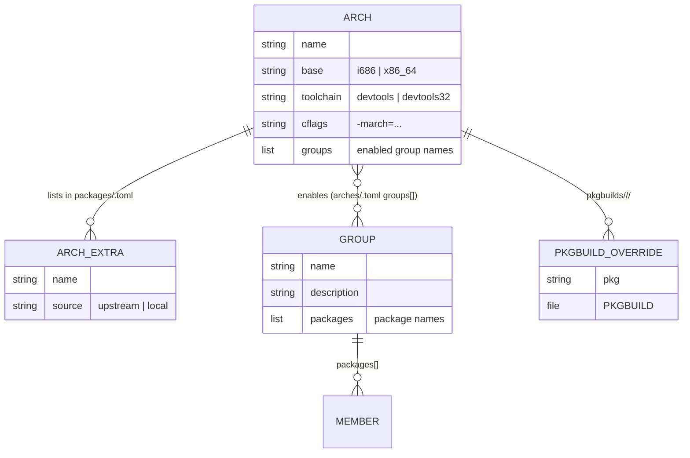
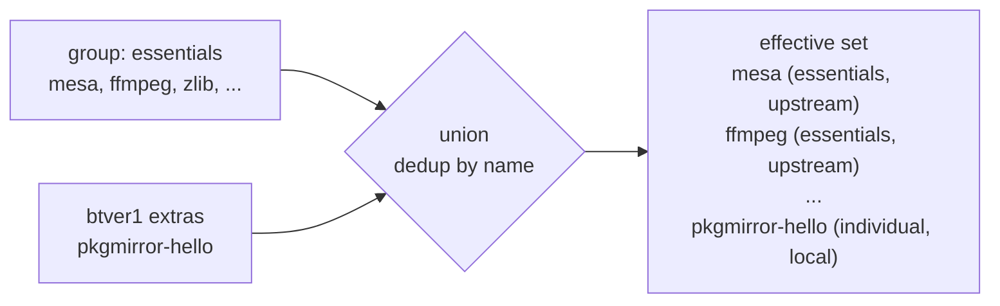

# Data model

All configuration is TOML under `config/`, read in-container through a single parser
(`dasel`) wrapped by helpers in [`bin/lib/common.sh`](../bin/lib/common.sh). Nothing
else parses TOML, so swapping parsers touches one file.

## Files at a glance

| File                              | Purpose                                                        |
|-----------------------------------|----------------------------------------------------------------|
| `config/arches/<arch>.toml`       | an architecture: base, toolchain, CFLAGS, chroot source, enabled groups |
| `config/groups/<group>.toml`      | a reusable named catalog of package names (arch-agnostic)      |
| `config/packages/<arch>.toml`     | per-arch **extra** packages + source overrides                |
| `config/pkgmirror.toml`           | global settings (concurrency, skip flags)                     |
| `pkgbuilds/<arch>/<pkg>/PKGBUILD` | local override PKGBUILD (patched/forked) — wins over upstream  |

## Relationships



### `config/arches/<arch>.toml`

```toml
name      = "btver1"
base      = "x86_64"                       # drives personality + chroot bootstrap
toolchain = "devtools"                      # devtools (x86_64) | devtools32 (i686)
cflags    = "-march=btver1 -mtune=btver1 -O2 -pipe"
groups    = ["essentials"]                  # which groups this arch builds

[chroot]
mirror  = "https://geo.mirror.pkgbuild.com/$repo/os/$arch"
keyring = "archlinux-keyring"
```

`base` is the key discriminator: `i686` builds are wrapped in `setarch i686` and the
chroot is bootstrapped from archlinux32 mirrors (with its keyring imported); `x86_64`
builds run natively with stock devtools.

### `config/groups/<group>.toml`

```toml
name        = "essentials"
description = "Packages worth recompiling with -march tuning"
packages    = ["mesa", "ffmpeg", "x264", "zlib", "openssl", ...]
```

A group is an **arch-agnostic list of package names** — "things worth building." It
does not say *how* to build them; source resolution is decided per arch at build time.

### `config/packages/<arch>.toml`

```toml
[[package]]
name   = "xf86-video-intel"   # atom-specific, not part of any group
source = "local"               # upstream | local (local scaffolds a PKGBUILD)
```

Per-arch **extras**: packages built for this arch beyond its groups, plus explicit
source overrides. Most packages live in groups; this file is for one-offs.

### `config/pkgmirror.toml` — global settings

```toml
build_concurrency = 3     # parallel package builds per arch (cores split across them)
skip_pgp_check    = true  # skip upstream SOURCE signature verification
skip_check        = true  # skip each package's check()/test suite
```

- **`build_concurrency`** — how many packages build simultaneously within one arch.
  Each gets its own chroot copy; `make -j` = `cores / build_concurrency`. Set `1` for
  strictly sequential builds.
- **`skip_pgp_check`** (default `true`) — the clean chroot has no upstream signing
  keys and PKGBUILDs come from official Arch git over HTTPS, so source-signature
  verification would otherwise fail with "unknown public key". Set `false` only if you
  import the needed keys.
- **`skip_check`** (default `true`) — **required for cross-tuned builds.** Packages are
  compiled with the *target's* `-march` (e.g. `btver1` emits SSE4A, an AMD-only ISA)
  but a package's `check()` runs the freshly-built binary on the *build host* (an Intel
  Xeon with no SSE4A), which can fault. Set `false` only if the build host shares the
  target's instruction set.

## The effective build set

What actually gets built for an arch is derived, not stored:

```
effective_packages(arch) =
      ⋃  members(g)  for g in arch.groups          # every enabled group's members
    ∪  { p.name for p in packages(arch) }          # per-arch extras
    (deduplicated by name)
```

For each resulting package:

- **`source`** = the explicit override in `packages/<arch>.toml` if present; otherwise
  `local` when `pkgbuilds/<arch>/<name>/PKGBUILD` exists (file presence is
  authoritative — the **local-override-wins** rule); otherwise `upstream`.
- **`origin`** = the group name(s) it came from and/or `individual`.



This derivation lives in `effective_packages` in
[`bin/lib/common.sh`](../bin/lib/common.sh) and is consumed by `build.sh`,
`update-check.sh`, and the web `/api/status` endpoint (via the same bash helper, so
the UI and CLI never disagree).

## Repository layout (served)

Each arch's built packages are exposed as a standard pacman repo whose **database name
matches the client's `pacman.conf` block**:

```
/srv/pkgmirror/repos/<arch>/
    <arch>-local.db            -> <arch>-local.db.tar.gz   (symlink)
    <arch>-local.db.tar.gz
    <pkgname>-<ver>-<rel>-<arch>.pkg.tar.zst
    ...
```

A client using `[btver1-local]` fetches `btver1-local.db` from `…/repos/btver1/`.
`repo-add --remove` prunes superseded package files as new versions land, and is
serialized by an flock so parallel builds don't corrupt the shared db.

## State files

Written by `build.sh` after each run, consumed by the UI:

```jsonc
// /srv/pkgmirror/state/<arch>/last-build.json
{
  "arch": "btver1",
  "start": 1783945104, "end": 1783945142,
  "filter": "group:essentials",     // all | group:<g> | pkg:<name>
  "status": "ok",                    // ok | failed | empty
  "jobs": 3,
  "packages": [
    { "name": "zlib", "result": "ok", "version": "1:1.3.2-3", "seconds": 118 },
    { "name": "xz",   "result": "ok", "version": "5.8.3-1",   "seconds": 96 }
  ]
}
```

`history.jsonl` appends one such object per run. `state/paused` is an empty flag file:
its presence suspends all builds (see [pause/resume](user-guide.md#pausing--freeing-the-box)).
